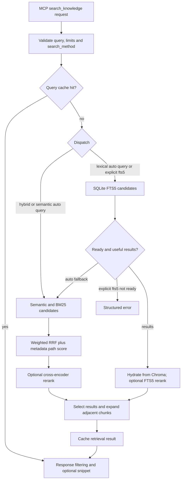

# Architecture

The server exposes 13 MCP tools over stdio or the configured HTTP transport.
Embeddings and retrieval run in the server process. A shared HTTP process can
serve several clients without loading a separate model and index per client.
See [single-instance operation](single-instance.md) for the process boundary.

This describes the implementation in this branch. Historical ADRs record design
decisions; they are not a substitute for the current configuration and API.

## Components and ownership

| Component | Responsibility | Lifetime / storage |
| --- | --- | --- |
| FastMCP tool layer | Validate requests, serialize results, rate limit and instrument calls | Server process |
| KnowledgeOrchestrator | Coordinate indexing, retrieval, metadata and derived indexes | Server process |
| IngestionEngine and parsers | Discover contained source paths, parse changed files, create chunks | Per indexing operation |
| FastEmbedEmbeddings | Lazy model loading, execution-provider validation, bounded embedding batches | Model session in process; weights in model cache |
| ChromaDB | Persist chunk text, metadata and vectors | Configured data directory, `chroma_db/` |
| BM25Index | Tokenize and rank keyword candidates with an inverted index | In process; rebuilt from ChromaDB |
| Fts5LexicalIndex | Optional derived lexical index keyed by chunk ID | `fts5_index.db` in the data directory |
| QueryCache | Cache retrieval results with bounded entry count and TTL | In process; invalidated by mutations |
| MetricsCollector | Aggregate counters, sums and registered histogram buckets | In process; observations are not retained individually |

Categories are configurable metadata, not a fixed number of collections.
Several supported file extensions share a parser; extension count and parser
class count are different measures.

## Retrieval flow

The FTS5 feature is disabled by default. In `auto` mode the regex router
classifies queries as lexical or semantic; the lexical branch can fall back to
hybrid retrieval. Explicit `fts5` bypasses the router and the minimum-hit
threshold, and reports an error when the index is unavailable. See
[FTS5 behavior](features/fts5_fast_path.md).

The separate keyword-to-category router produces informational `routed_by`
metadata. It does **not** automatically restrict the search. An explicit
`category` argument filters semantic retrieval in ChromaDB; the BM25 and FTS5
paths filter the retrieved candidate pool using chunk metadata. This distinction
matters for sparse categories: filtering a bounded global pool can miss relevant
items outside that pool. Folder filtering before candidate selection is tracked
in [issue #232](https://github.com/lyonzin/knowledge-rag/issues/232).

For hybrid retrieval, semantic and keyword branches run concurrently when both
weights are nonzero. Documents found only by BM25 are hydrated in a batch.
Cross-encoder reranking, when enabled, scores a candidate pool before the final
result limit. Adjacent chunks add context to selected results.

Scores depend on the retrieval path and optional reranking. A normalized score
is a ranking signal, not a probability that the answer is correct. The MCP layer
applies `min_score` and optional snippet truncation; those operations must not
mutate a cached full-content result.

## Ingestion and publication

Incremental scans inspect paths and modification metadata before parsing.
Discovery rejects links that escape the configured corpus and avoids cycles.
A parsing failure must preserve the previously indexed document and remain
visible in the operation's errors.

A full rebuild creates a separate staging collection and staging metadata.
The live collection remains available while staging is populated and validated.
Publication spans several ChromaDB and metadata operations; it is not a single
database transaction. The previous collection is retained until publication
succeeds so handled failures can roll back. Abrupt process termination still
requires inspection of the persisted state. See the
[reindex operations guide](reindex-operations.md) for recovery and storage costs.

FTS5 is derived from ChromaDB. Its migration and mutation paths use chunk IDs to
avoid duplicates during replay. Migration counters use historical
`docs_*` names but count **chunks**, not source files.

## Memory and concurrency boundaries

Embedding microbatches and outer indexing batches are separate controls.
Provider-aware defaults limit the number of simultaneous model inputs; long
documents, tokenizer buffers, model weights and ChromaDB still consume memory.
See [GPU and CPU configuration](gpu-setup.md).

Indexing streams documents, but a parser may materialize an entire individual
file, and replacement rollback retains the old chunks for that document.
This bounds whole-corpus accumulation; it does not make arbitrary-sized files
constant-memory. BM25 retains corpus data in memory, while ChromaDB and FTS5
also use native/database caches. Process RSS therefore includes more than Python
allocations tracked by `tracemalloc`.

Mutating operations are coordinated within one orchestrator. The optional
single-instance lock addresses multiple server processes sharing a data
directory. It is a different boundary from threads inside one process.
Read queries during mutation may observe an earlier or later published state;
clients should not assume a transaction across separate MCP calls.

## The hybrid_alpha parameter

| Value | Candidate contribution on the hybrid path |
| --- | --- |
| `0.0` | BM25 only |
| `0.3` | Greater BM25 weight; the default configuration |
| `0.5` | Equal RRF weights |
| `0.7` | Greater semantic weight |
| `1.0` | Semantic only |

The RRF constant is 60 and ranks are one-based. Metadata path scoring and
optional reranking also affect the final order. Changing alpha does not by
itself establish a latency or quality improvement. Measure representative
queries and expected sources with [evaluate_retrieval](API.md).
Alpha is not used by the FTS5 path; select `search_method="hybrid"` when comparing
hybrid weights.

## References

- [Configuration](CONFIGURATION.md)
- [MCP API](API.md)
- [Installation](INSTALLATION.md)
- [Security boundaries](../SECURITY.md)
